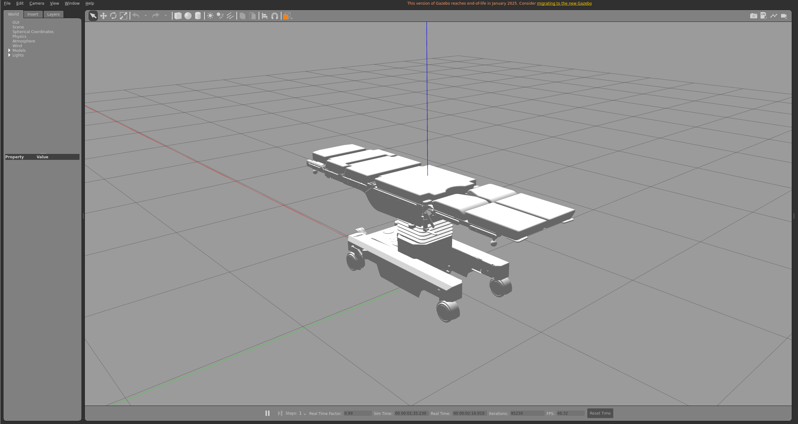
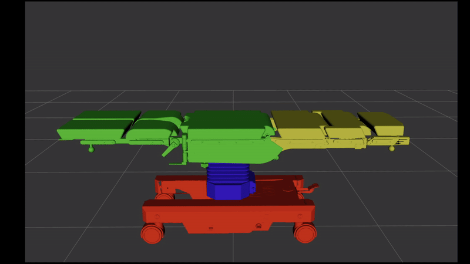

# Modelling, Control and Integration of OPT 40/1 Surgical Table in ROS2	

## Overview

This project focuses on the **modelling, control and ROS2 integration** of the **OPT 40/1 surgical table**, a mobile operating table currently controlled via physical buttons.
The main objective is to achieve **automated and programmable movement** of the table by integrating it into a robotic system architecture using **ROS2**.

## Technologies Used
- **ROS2 (Robot Operating System 2)** – for communication and system integration
- **URDF/Xacro** – to model the surgical table and its kinematics
- **RViz2** – for 3D visualization and TF inspection
- **Gazebo** – for simulation of the physical environment and table movement

## Project Goals
- Digitally replicate the OPT 40/1 surgical table using URDF/Xacro.
- Simulate the table’s behavior and motion using Gazebo and RViz2.
- Enable integration of the model with ROS2 controllers for motion commands.

## Installation
> Prerequisites: ROS2 Humble installed and sourced.

To use this package in ROS2, first clone this repository in a ROS2 workspace, e.g. `ros2_ws`:
```bash
# Clone the repository into your ROS2 workspace
mkdir -p ~/ros2_ws/src && cd ~/ros2_ws/src
git clone https://github.com/idra-lab/opt_description.git
```
Then, it is simply necessary to build and source the workspace:
```bash
# Go to workspace
cd ~/ros2_ws
# Build the workspace
colcon build --symlink-install
# Source the workspace
source install/setup.bash
```

## Visualize the table in RViz2 and Gazebo
To test the robot and visualize it in the `Gazebo` environment and `Rviz2`, you can directly call the command:
```bash
ros2 launch opt_description show_launch.py
```


<p align="center">
  
  
  
</p>

## Acknowledgments

This thesis project was developed in collaboration with the **Interdepartmental Robotics Labs (IDRA)** at the University of Trento. We thank IDRA for providing the resources, expertise, and support that made this research possible.
